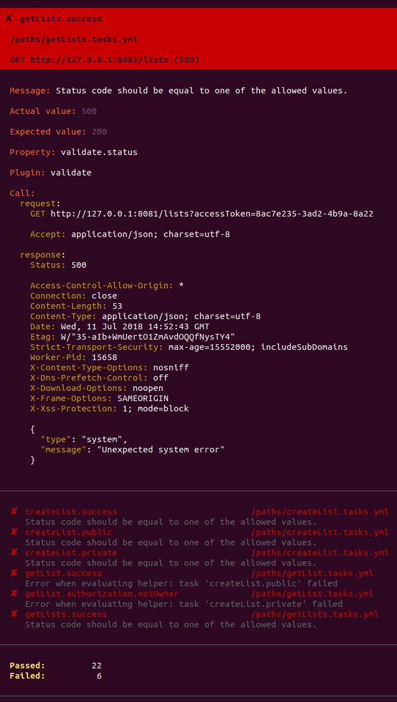

[](https://www.npmjs.com/package/test-openapi) [](https://github.com/Cardero-X/test-openapi/graphs/contributors) [](https://travis-ci.org/Cardero-X/test-openapi/builds) [](#) [](https://gitter.im/ehmicky/test-openapi)

Automatic API integration testing.

# Features

- **Declarative**. Tasks are specified in [simple YAML files](#tasks).
- **Easy**. Each task is a single HTTP request/response. You only need to
  specify the [request parameters](#http-requests) and the
  [response validation](#response-validation). More complex requests flows
  [are also supported](#sequences-of-requests).
- Integrated to [**OpenAPI**](#openapi). Tasks re-use your OpenAPI
  specification by default, making them less verbose and ensuring they match
  your documentation.
- **Fast**. Tasks have minimum overhead and run in parallel.
- Nice **developer experience**. [Reporting](#example-output) is pretty,
  informative and usable.
- [**Data-driven testing**](#data-driven-testing) thanks to a simple
  [templating system](#template-variables)
- **Flexible**. Core functionalities can be extended with plugins.

# Installation

```shell
$ npm install -D test-openapi
```

# Usage (shell)

```shell
$ test-openapi
```

If a task failed, exit code will be `1`.

Options are passed as CLI flags.

```shell
$ test-openapi --merge.spec.definition openapi_schema.yml
```

Tasks are passed as positional argument.

```shell
$ test-openapi **/*.tasks.yml
```

# Usage (Node.js)

```js
const { run } = require('test-openapi')

const promise = run(options)
```

If a task failed, `run()` will reject the promise with a `TestOpenApiError`.

Options are passed as arguments. Tasks are passed as a `tasks` argument.

```js
const promise = run({
  tasks: ['**/*.tasks.yml'],
  merge: { spec: { definition: 'openapi_schema.yml' } },
})
```

# Tasks

Tasks are specified in YAML or JSON files.

By default tasks at `**/*.tasks.yml|json` will be used.

Each task file contains an array of tasks definitions.

A single task performs the following:

- sends an HTTP request to the API. The request parameters are specified using
  the [`call` property](#http-requests).
- validates the HTTP response according to the
  [`validate` property](#response-validation).

Each task must specify a `name` unique within its file.

# Example input

```yml
- name: exampleTask
  call:
    method: GET
    server: http://localhost:8081
    path: /tags
    query.onlyPublic: false
  validate:
    status: 200
    body:
      type: array
      # Each tag object
      items:
        type: object
        required: [tag, isPublic]
        properties:
          tag:
            type: string
            maxLength: 32
          isPublic:
            type: boolean

# And so on
- name: anotherTask
```

This task calls:

```http
GET http://localhost:8081/icoTagNames?onlyPublic=false
```

It then validates that:

- the response status is `200`
- the response body is an array of `{ tag: string, isPublic: boolean }`

# Example output

This screenshot shows a typical task run with few task failures.



The failed task is called `getLists.success` and performs the following HTTP
request:

```http
GET http://127.0.0.1:8081/lists?accessToken=8ac7e235-3ad2-4b9a-8a22
```

It expects a status code of 200 but receives 500 instead.

Other tasks are shown failing at the end. A final summary is also present.

# HTTP requests

HTTP requests are specified with the `call` task property.

```yml
- name: taskName
  call:
    method: PUT
    server: https://localhost:8081
    path: /tags/:tagName
    url.tagName: exampleTagName
    query.accessToken: 1e42f0e1
    headers.content-type: application/json
    body:
      _id: 1
      name: exampleTagName
      color: red
    https:
      rejectUnauthorized: false
```

- `method` `{string}` (default: `GET`): HTTP method
- `server` `{string}`:
  - server's origin (protocol + hostname + port)
  - default values:
    - protocol: `http://`
    - hostname: environment variable `HOST` or (if absent) `localhost`
    - port: environment variable `PORT` (if present)
- `path` `{string}`: URL's path
- `url.NAME` `{any}`:
  - variable inside `server` or `path` using the `:NAME` notation
  - for example if the `path` is `/tags/:tagName` it can be `url.tagName`
  - the syntax is the same as
    [Express route parameters](https://expressjs.com/en/guide/routing.html#route-parameters):
    - `:NAME`: required parameter
    - `:NAME?`: optional parameter
    - `:NAME*`: several optional parameters
    - `:NAME+`: several required parameters
- `query.NAME` `{any}`:
  - URL query variable
  - specify a list delimited by `&=` to use `NAME` several times
    - e.g. `query.name: "a&=b&=c"` becomes the query variables
      `?name=a&name=b&name=c`
- `headers.NAME` `{any}`:
  - HTTP request header
  - case insensitive
  - `headers.content-type` defaults to:
    - `application/json` if `body` is an object or an array
    - `application/octet-stream` otherwise
- `body` `{any}`: request body
- `https` `{object}`:
  - HTTPS/TLS options
  - Same as the ones allowed by [https.request()](https://nodejs.org/api/https.html#https_https_request_options_callback), i.e. `ca`, `cert`, `ciphers`, `clientCertEngine`, `crl`, `dhparam`, `ecdhCurve`, `honorCipherOrder`, `key`, `passphrase`, `pfx`, `rejectUnauthorized`, `secureOptions`, `secureProtocol`, `servername`, `sessionIdContext`.

`url.NAME`, `query.NAME`, `headers.NAME` and `body` can be either a string or
any other JSON type:

- they will be serialized according to the HTTP request header `Content-Type`
- however at the moment only JSON is supported. Notably `multipart/form-data`
  and `x-www-form-urlencoded` are not supported yet.
- same goes for the response headers and body

# Response validation

The HTTP response is validated against the `validate` task property.

```yml
- name: taskName
  validate:
    status: 201
    headers.content-type: application/json
    body:
      type: array
```

- `status` `{string|integer}`:
  - expected HTTP status code
  - can be:
    - a specific status code like `201`
    - a range like `1xx`, `2xx`, `3xx`, `4xx` or `5xx`
    - a space-delimited list of these like `201 202 3xx`
  - default: `2xx`
- `headers.NAME` `{any|jsonSchema}`:
  - expected value for this HTTP response header
  - `NAME` is case-insensitive
  - this can be either:
    - any value checked for equality
    - a
      [JSON schema version 4](https://github.com/OAI/OpenAPI-Specification/blob/master/versions/2.0.md#schemaObject) with the additional following properties:
      - `x-optional` `{boolean}` (default: `true`): if `false`, validate that
        the HTTP header is present in the response
      - `x-forbidden` `{boolean}` (default: `false`): if `true`, validate
        that the HTTP header is not present in the response
- `body` `{any|jsonSchema}`:
  - expected value for the response body
  - this can be either a non-object checked for equality or a
    [JSON schema version 4](https://github.com/OAI/OpenAPI-Specification/blob/master/versions/2.0.md#schemaObject)
    (like `headers.NAME`)

Validation can also vary according to the response's status code by using the
following notation.

```yml
- name: taskName
  validate:
    201:
      body:
        type: array
    400:
      body:
        type: object
```

# OpenAPI

The `call` and `validate` tasks properties can be pre-filled if you have
described your API endpoints with [OpenAPI](https://www.openapis.org/).

```yml
- name: taskName
  spec:
    operation: getTags
    definition: ../openapi_document.yml
```

- `operation` `{string}`: OpenAPI's
  [`operationId`](https://github.com/OAI/OpenAPI-Specification/blob/master/versions/2.0.md#operation-object)
- `definition` `{string}`:
  - path to the OpenAPI document
  - it is likely that the same OpenAPI document is re-used across tasks, so
    the [`merge` task property](#shared-properties) can be used
  - the OpenAPI document syntax is validated
  - only OpenAPI 2.0 is currently supported but we plan to add OpenAPI 3.0
    support

The following OpenAPI properties are currently used:

- the
  [`consumes` OpenAPI property](https://github.com/OAI/OpenAPI-Specification/blob/master/versions/2.0.md#operation-object)
  sets the request `Content-Type` header (`call['headers.content-type']`)
- the
  [`produces` OpenAPI property](https://github.com/OAI/OpenAPI-Specification/blob/master/versions/2.0.md#operation-object)
  sets the request `Accept` header (`call['headers.accept']`) and validate the
  response's `Content-Type` header (`validate['headers.content-type']`)
- the
  [`host` and `basePath` OpenAPI properties](https://github.com/OAI/OpenAPI-Specification/blob/master/versions/2.0.md#swagger-object) set the
  `call.server` task property. At the moment the protocol is always `http://`.
- the `call.method` and `call.path` is taken from the
  [OpenAPI definition](https://github.com/OAI/OpenAPI-Specification/blob/master/versions/2.0.md#path-item-object)
- the request parameters are randomly generated from the
  [`parameters` OpenAPI property](https://github.com/OAI/OpenAPI-Specification/blob/master/versions/2.0.md#parameterObject):
  - the random generation is based on
    [JSON schema faker](https://github.com/json-schema-faker/json-schema-faker)
  - OpenAPI parameters not marked as `required` will only be used (and merged)
    if they are explicitly present in the `call` task property
  - the following special values can used in the `call` task property:
    - `valid`: re-use the OpenAPI parameter definition. Useful if the OpenAPI
      parameter is not marked as `required`. Redundant otherwise.
    - `undefined`: do not use the OpenAPI parameter definition
- the
  [response's](https://github.com/OAI/OpenAPI-Specification/blob/master/versions/2.0.md#responseObject) `schema` and `headers` OpenAPI properties are used to
  validate the HTTP response (`validate.status|body|headers`)

OpenAPI schemas can use the following extensions:

- `schema.x-nullable|oneOf|anyOf|not`: behaves like OpenAPI 3.0
  `nullable|oneOf|anyOf|not`
- `schema.x-additionalItems|dependencies`: behaves like JSON schemas
  `additionalItems|dependencies`

# Shared properties

To specify properties shared by all tasks, use the `merge` option:

```shell
$ test-openapi --merge.spec.definition ../openapi_document.yml
```

To specify properties shared by a few tasks, create a task with a `merge`
property.

```yml
- name: sharedTask
  merge: invalidCheck/.*
  validate:
    status: 400
```

The `merge` property should be a regular expression (or an array of them)
targeting other tasks by `name`.
The shared task will not be run. Instead it will be deeply merged to the target
tasks.

The target tasks can override the shared task by using `undefined` inside task
properties.

# Template variables

Template variables can be used using the `$$name` notation.

Template variables are specified using the `template` task property.

```yml
- name: exampleTask
  template:
    $$exampleVariable: true
  call:
    query.isPublic: $$exampleVariable
```

The example above will be compiled to:

```yml
- name: exampleTask
  call:
    query.isPublic: true
```

Template variables can:

- be concatenated within a string like `$$exampleVariable --- $$anotherVariable`
- use brackets and dots to access object properties and array indexes like
  `$$exampleArray[0].propertyName`
- be functions:
  - by default they are triggered with no arguments
  - to specify arguments one can use the following notation:
    `{ $$exampleFunction: [firstArg, secondArg] }`

The following template variables are always available:

- `$$env`: use environment variables (case-sensitive)
- `$$random`: generate fake data using a
  [JSON schema version 4](https://github.com/OAI/OpenAPI-Specification/blob/master/versions/2.0.md#schemaObject)
- `$$faker`: generate fake data using
  [Faker.js](https://github.com/marak/Faker.js/)

```yml
- name: exampleTask
  call:
    server: $$env.SERVER
    query.password:
      $$random:
        type: string
        minLength: 12
        pattern: '[a-zA-Z0-9]'
    body:
      name: $$faker.name.firstName
```

# Sequences of requests

A request can save its response using `variables`. Other requests will be able
to re-use it as template variables.
This creates sequences of requests.

```yml
- name: createAccessToken
  variables:
    $$accessToken: call.response.body.accessToken

- name: taskName
  call:
    query.accessToken: $$accessToken
```

The `call.request` and `call.response` are available to re-use the HTTP request
and response.

The task will fail if the variable is `undefined` unless you append the word
`optional` to its value.

```yml
- name: createAccessToken
  variables:
    $$accessToken: call.response.body.accessToken optional
```

# Tasks selection

By default all tasks are run in parallel at the same time.

To only run a few tasks use the `only` option.

```shell
$ test-openapi --only 'taskNameRegularExpression/.*'
```

Or the `only` task property.

```yml
- name: taskName
  only: true
```

The `skip` option and task property can be used to do the opposite.

# Reporting

The following reporters are available:

- `pretty`: default reporter
- `tap`: [Test Anything Protocol](https://testanything.org/)
- `notify`: desktop notification
- `data`: JSON output

Specify the `--report.REPORTER` option to select which reporter to use

```shell
$ test-openapi --report.notify --report.pretty
```

Use the `--report.REPORTER.output` to redirect the output of a reporter to a
file:

```shell
$ test-openapi --report.pretty.output path/to/file.txt
```

Use the `--report.REPORTER.level` to modify the verbosity:

```shell
$ test-openapi --report.pretty.level info
```

The available levels are:

- `silent`
- `error`
- `warn` (default for `pretty`)
- `info` (default for `tap` and `notify`)
- `debug` (default for `data`)

# Data-driven testing

With the `repeat.data` task property, tasks are repeated by iterating over
an array of inputs.

```yml
- name: exampleTask
  repeat:
    data:
      - name: apples
        quantity: 1
      - name: oranges
        quantity: 10
      - name: plums
        quantity: 100
  call:
    method: GET
    path: /fruits/:fruitName
    url.fruitName: $$data.name
    query:
      quantity: $$data.quantity
```

The task above will be run three times: `GET /fruits/apples?quantity=1`,
`GET /fruits/oranges?quantity=10` and `GET /fruits/plums?quantity=100`.

With the `repeat.times` task property, tasks are simply repeated as is. This can
be useful when used with the `$$random` template function.

```yml
- name: exampleTask
  repeat:
    times: 10
```

`repeat.data` and `repeat.times` can be combined.
